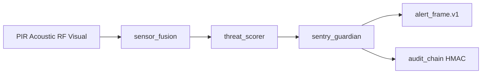

# Project SENTRY

**Organization:** Fratres X AI — Defense Projects HQ  
**Codename:** SENTRY — passive Pi Zero 2 W early-warning mesh node  
**Type designation:** **AN/GSQ-100(V)1** · **SENTRY Node Mk I**  
**4-node kit:** **AN/GSQ-100A(V)1** · SENTRY Net (4-pack)  
**Mode:** Defensive-only · Receive-only

> **Start here for the full on-paper system:** [`docs/system_datasheet.md`](docs/system_datasheet.md)  
> Dimensions, BOM, wiring, 4-node layout, power math, every output, acceptance gates.

| Document | Contents |
|----------|----------|
| [`docs/system_datasheet.md`](docs/system_datasheet.md) | **Master spec** — mechanical, electrical, RF, mesh, outputs |
| [`docs/bom_dimensions.md`](docs/bom_dimensions.md) | Part sizes, masses, site totals |
| [`docs/outputs_icd.md`](docs/outputs_icd.md) | All JSON outputs + file paths |
| [`configs/deployment_site_alpha.json`](configs/deployment_site_alpha.json) | Example 4-node site (240×180 m) |
| [`docs/pi_deployment.md`](docs/pi_deployment.md) | Install & bench commands |
| [`docs/risk_register.md`](docs/risk_register.md) | Blunt risks |

**Repository:** [SENTRY-Node-Mk-I](https://github.com/Fratres-X-AI/SENTRY-Node-Mk-I) · **Version:** 0.3.0 · **Type:** AN/GSQ-100(V)1

| Area | Status |
|------|--------|
| Simulated PIR / acoustic / RF / visual fusion | Implemented & Tested (synthetic) |
| Threat scoring (CLEAR → YELLOW → ORANGE → RED → HOLD) | Implemented & Tested (synthetic) |
| Guardian dwell-confirm + cooldown state machine | Implemented & Tested (synthetic) |
| HMAC audit hash chain | Implemented & Tested (synthetic) |
| JSON Schema + simulation V&V | Implemented & Tested (synthetic) |
**Maturity:** v0.3.0 — Pi Zero 2 W drivers with simulation fallback; **not field-validated**

| Area | Status |
|------|--------|
| `sensors/rf_sensor.py` — rtl_power 2.4 GHz + 5.8 GHz synthetic | Implemented (2g4 hardware on Pi) |
| `sensors/acoustic_sensor.py` — SciPy FFT peaks 100–500 Hz | Implemented |
| `sensors/power_metrics.py` — psutil + watt estimates | Implemented |
| `networking/meshtastic_handler.py` — OMEN mesh relay | Implemented (TX + spool) |
| Tamper GPIO → HMAC audit + wipe (dry-run default) | Implemented |
| systemd + udev + bootstrap | Template ready |
| Field validation on real sensors | **Not started** |

SENTRY is constellation stage **#1** (passive sense) and **#4** (guardian watch): a Raspberry Pi edge node that fuses passive sensor channels, scores threat evidence, and emits early-warning alerts with an immutable audit trail. **No engagement, kinetic, or weaponization logic.**

## Architecture



## Quickstart

```powershell
cd implementation
pip install -e ".[dev]"
pytest tests/ -q
sentry-guard --probe
sentry-sim --scenario intrusion
sentry-guard --live --duration 10
sentry-guard --failure-modes
python ..\run_complete_audit.py
```

Pi Zero 2 W field install: see [`docs/pi_deployment.md`](docs/pi_deployment.md).

## Project layout

| Path | Purpose |
|------|---------|
| [`implementation/src/sentry/sensors/`](implementation/src/sentry/sensors/) | RF (rtl_power), acoustic FFT, power metrics |
| [`implementation/src/sentry/networking/`](implementation/src/sentry/networking/) | Meshtastic OMEN mesh handler |
| [`implementation/src/sentry/simulation/`](implementation/src/sentry/simulation/) | Synthetic scenarios + desktop fallback |
| [`schemas/`](schemas/) | `sensor_event.v1`, `alert_frame.v1`, `audit_entry.v1` |
| [`configs/`](configs/) | Mission profile and Pi node configuration |
| [`deploy/`](deploy/) | systemd unit, udev rules, bootstrap script |
| [`docs/risk_register.md`](docs/risk_register.md) | Blunt risk register |
| [`validation/reports/`](validation/reports/) | Generated simulation and audit artifacts |
| [`docs/`](docs/) | Overview and Pi deployment notes |

## Simulation scenarios

| Scenario | Expected peak level |
|----------|---------------------|
| `benign` | CLEAR / YELLOW |
| `intrusion` | ORANGE / RED |
| `jamming` | HOLD (hold-safe) |
| `low_visibility` | YELLOW / ORANGE (degraded visual) |

## Safety

- Human-on-loop assumed for all alert response
- HOLD level triggers on RF jamming suspicion — no automated counter-action
- Immutable HMAC audit chain for post-incident review
- Defensive-only scope: early warning and perimeter guardian watch

## License

MIT — Fratres X AI Defense Projects HQ
