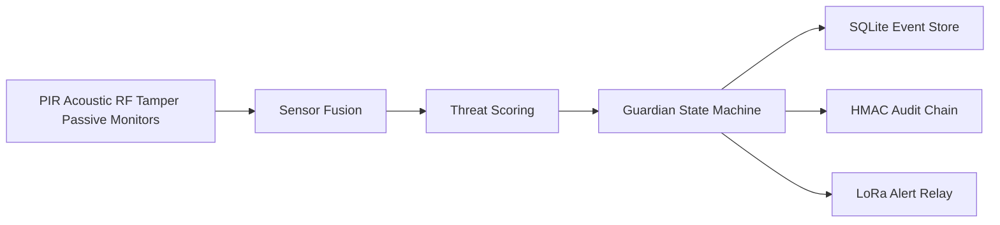

# SENTRY Node Mk I

SENTRY is an open-source, defensive early-warning node for a Raspberry Pi Zero 2 W. In plain terms: it is a small weatherproof sensor box that listens for motion, sound, radio activity, tamper events, and lightweight network anomalies. It turns those signals into a simple alert level, writes tamper-evident local records, and can relay short low-power LoRa alerts so a human can investigate.

SENTRY does not jam, target, engage, or automate any response. It is a passive monitoring and audit system.

## Status

Version: `0.5.0-darkspace-integrated`

Software gates pass on desktop/CI. Physical gates still require real hardware bench testing.

## What It Does

- Fuses passive sensor evidence into `CLEAR`, `YELLOW`, `ORANGE`, `RED`, or `HOLD`.
- Logs all events to SQLite and critical events to an HMAC audit chain.
- Suppresses mesh transmission in HOLD/jamming conditions while preserving local logs.
- Adds lightweight DARKSPACE modules: psutil network anomaly sampling and log entropy scanning.
- Includes Pi bootstrap, systemd units, BOM, wiring docs, and validation scripts.

## Start Here

| Document | Purpose |
|----------|---------|
| [`docs/system_datasheet.md`](docs/system_datasheet.md) | Full system spec, power math, RF notes, outputs |
| [`docs/build_assembly.md`](docs/build_assembly.md) | Physical assembly and GPIO wiring |
| [`docs/pi_deployment.md`](docs/pi_deployment.md) | Pi install and service setup |
| [`docs/BUILD_STAGE.md`](docs/BUILD_STAGE.md) | Build gates and go/no-go rules |
| [`configs/procurement_bom.json`](configs/procurement_bom.json) | Production 4-node BOM |
| [`SECURITY.md`](SECURITY.md) | Vulnerability reporting |
| [`CONTRIBUTING.md`](CONTRIBUTING.md) | Contribution rules |

## Quickstart

```powershell
cd implementation
pip install -e ".[dev]"
pytest tests --cov=sentry --cov-fail-under=100 -q -k "not gpu"
mypy src/sentry
cd ..
python validation/build_readiness.py
python run_complete_audit.py
```

## Architecture



## Important Limits

- RTL-SDR Blog V4 is not a native 5.8 GHz receiver. The 5.8 GHz path is synthetic until a suitable front-end is added.
- Field false-positive and false-negative rates are not proven until G1-G5 hardware testing is complete.
- Mesh receive is currently a conservative spool/manual integration path.
- `tamper_response.dry_run` defaults to `true`; destructive wipe behavior must be explicitly enabled.

## License

MIT. See [`LICENSE`](LICENSE).
