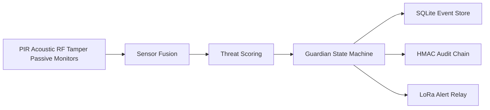

# SENTRY Node Mk I

SENTRY is an open-source, defensive early-warning node for a Raspberry Pi Zero 2 W. In plain terms: it is a small weatherproof sensor box that listens for motion, sound, radio activity, tamper events, and lightweight network anomalies. It turns those signals into a simple alert level, writes tamper-evident local records, and can relay short low-power LoRa alerts so a human can investigate.

SENTRY does not jam, target, engage, or automate any response. Its sensors are passive; the only intended transmission is short, low-power LoRa alert text for human review.

## Validation Results (front page)

**Maturity:** software-gate prototype (pre-physical)  
**Version:** `0.5.0-darkspace-integrated`  
**Snapshot:** 2026-07-19T21:30:25Z  
**Overall software gates:** **PASS**

Full committed evidence (JUnit, coverage XML, audit JSON, logs): [`validation/published/`](validation/published/) · narrative report: [`RESULTS.md`](validation/published/RESULTS.md)

### What is proven vs not

| Claim | Status |
|-------|--------|
| Threat scoring across benign / intrusion / jamming / low-vis | Proven in simulation |
| HMAC audit chain valid + tamper detection | Proven in CI/sim |
| Strict typing (mypy) | Proven — 46 files, 0 errors |
| Unit tests (measured core) | Proven — 38/38 |
| Mean simulated power under 5 W target | Proven in sim — ~3.3 W |
| Field FP/FN, Pi GPIO/USB, RF front-end | **Not proven** — needs G1–G5 hardware |
| High-g / chain-deploy COTS survival | **Not a product claim** — stress sims show near-zero survival by design |

### Gates

| Gate | Result | Detail |
|------|--------|--------|
| Pytest | PASS | 38/38 in 51.5 s |
| Coverage (include set only) | PASS | 100% of **47 measured lines** — not “100% of the repo” |
| Mypy (strict) | PASS | 46 files, 0 errors |
| Simulation smoke | PASS | intrusion path, audit valid |
| Build readiness (software) | PASS | required files + site layout |
| Defense readiness audit | PASS | scenarios + resilience + tamper probe |

### Scenario battery (expected behavior)

| Scenario | Result | Max level | Mean CPU % | Mean W | Audit |
|----------|--------|-----------|------------|--------|-------|
| benign | PASS | CLEAR | 50.1 | 3.3 | valid |
| intrusion | PASS | RED | 46.6 | 3.3 | valid |
| jamming | PASS | HOLD | 41.3 | 3.3 | valid |
| low_visibility | PASS | YELLOW | 35.8 | 3.3 | valid |

Quiet stays CLEAR. Intrusion goes RED. Jamming forces HOLD. Degraded visibility stays elevated, not catastrophic.

### Resilience battery (injected faults)

**PASS here means the node refuses to lie under bad conditions.** Counts like `0/8 operational` are expected stress outcomes, not a silent product failure.

| Mode | Gate | Meaning |
|------|------|---------|
| sensor_dropout_rf | PASS | RF loss degrades confidence; does not fabricate RED |
| thermal_throttle_jamming | PASS | Thermal + jamming enters safe HOLD |
| tamper_during_intrusion | PASS | Tamper dominates; HOLD wins |
| low_power_duty_cycle | PASS | Power discipline retained |
| deployment_chain_break | PASS | Broken chain reported as non-operational (`0/8`) |
| deployment_entanglement | PASS | Entangled nodes do not fake mesh readiness |
| deployment_antenna_damage | PASS | Damaged antennas fail BIT honestly |
| deployment_alert_suppression | PASS | Alerts suppressed until operational phase |

### Explicit non-claims

- Not field-validated. No outdoor FP/FN study yet.
- RTL-SDR Blog V4 is not a native 2.4/5.8 GHz solution.
- Meshtastic RX remains a conservative spool/integration path.
- High-g / line-charge reference sims destroy COTS Pi stacks — physics boundary, not a shipping promise.

## Status

Version: `0.5.0-darkspace-integrated`  
Maturity: **software-gate prototype (pre-physical)**

## What It Does

- Fuses passive sensor evidence into `CLEAR`, `YELLOW`, `ORANGE`, `RED`, or `HOLD`.
- Logs all events to SQLite and critical events to an HMAC audit chain.
- Suppresses mesh transmission in HOLD/jamming conditions while preserving local logs.
- Adds lightweight DARKSPACE modules: psutil network anomaly sampling and log entropy scanning.
- Includes Pi bootstrap, systemd units, BOM, wiring docs, and validation scripts.

## Start Here

| Document | Purpose |
|----------|---------|
| [`validation/published/RESULTS.md`](validation/published/RESULTS.md) | Full validation evidence pack |
| [`docs/system_datasheet.md`](docs/system_datasheet.md) | Full system spec, power math, RF notes, outputs |
| [`docs/build_assembly.md`](docs/build_assembly.md) | Physical assembly and GPIO wiring |
| [`docs/pi_deployment.md`](docs/pi_deployment.md) | Pi install and service setup |
| [`docs/BUILD_STAGE.md`](docs/BUILD_STAGE.md) | Build gates and go/no-go rules |
| [`configs/procurement_bom.json`](configs/procurement_bom.json) | Production 4-node BOM |
| [`SECURITY.md`](SECURITY.md) | Vulnerability reporting |
| [`CONTRIBUTING.md`](CONTRIBUTING.md) | Contribution rules |

## Quickstart

```powershell
cd implementation
pip install -e ".[dev]"
pytest tests --cov=sentry --cov-fail-under=100 -q -k "not gpu"
mypy src/sentry
cd ..
python validation/build_readiness.py
python run_complete_audit.py
```

## Architecture



## Important Limits

- RTL-SDR Blog V4 is not a native 2.4 GHz or 5.8 GHz receiver. Treat 2.4 GHz as a bench-proven conversion path and 5.8 GHz as synthetic until a suitable front-end is added.
- Field false-positive and false-negative rates are not proven until G1-G5 hardware testing is complete.
- Mesh receive is currently a conservative spool/manual integration path.
- `tamper_response.dry_run` defaults to `true`; destructive wipe behavior must be explicitly enabled.

## License

MIT. See [`LICENSE`](LICENSE).
