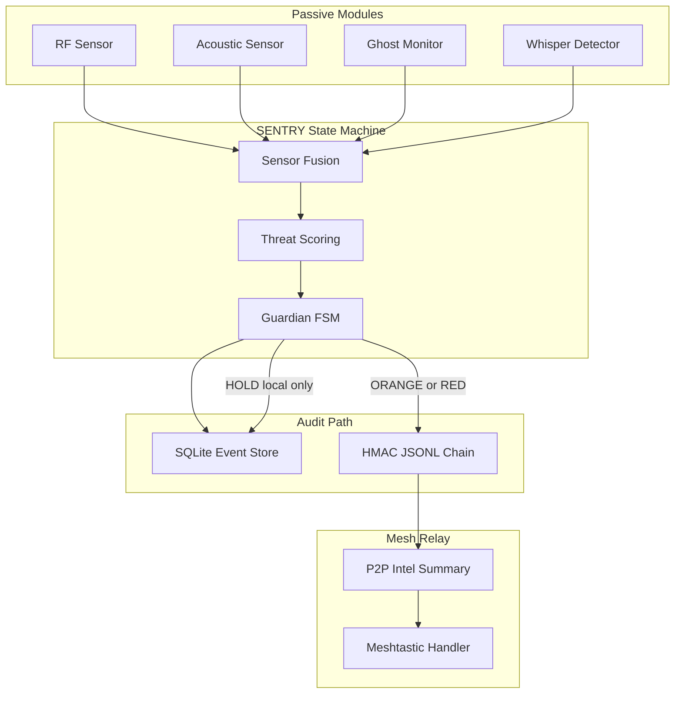

# SENTRY-DARKSPACE Integration Architecture

SENTRY remains the authority for field behavior: passive sensors feed fusion, the guardian owns CLEAR/YELLOW/ORANGE/RED/HOLD, and HOLD never transmits over the mesh. DARKSPACE contributes only low-overhead passive detection that can run inside a Raspberry Pi Zero 2 W RAM budget.

## Passive Network Anomaly Flow

`ghost_monitor` uses `psutil.net_io_counters` only. It does not capture packets, parse payloads, or require Scapy. It tracks rolling byte deltas and sample timing; regular small bursts raise `passive_network_anomaly` and add a small `passive_score`.

`whisper_detector` scans local log text fields for encoded-looking, high-entropy strings. It emits `steganography_suspected` when entropy is above threshold and the text shape looks compressed or encoded.

Fusion adds the passive score as a small weighted boost. Scoring floors whisper alerts to YELLOW, escalates network anomalies with elevated evidence to ORANGE, and keeps RF jamming behavior unchanged: jamming enters HOLD. In HOLD, SENTRY keeps writing SQLite and HMAC evidence but suppresses Meshtastic transmit attempts to save power and avoid unreliable RF behavior.

Every alert is inserted into SQLite first. ORANGE, RED, HOLD, and tamper events are also appended to the immutable HMAC JSONL chain. ORANGE and RED summaries are signed by `p2p_mesh.py` before passing through the existing Meshtastic OMEN queue.
