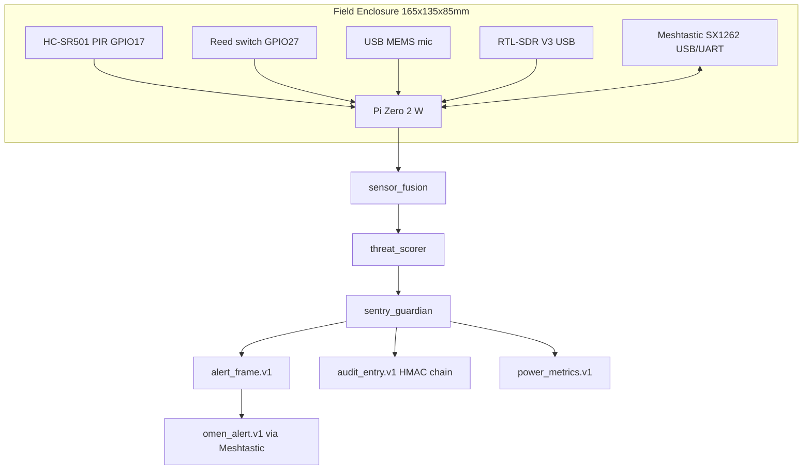

# SENTRY System Datasheet

**Codename:** SENTRY · **Version:** 0.3.0 · **Date:** 7 June 2026  
**Organization:** Fratres X AI — Defense Projects HQ  
**Mode:** Defensive-only · Passive early warning · **Working specification on paper**

| Field | Value |
|-------|-------|
| **Type designation** | **AN/GSQ-100(V)1** |
| **Common name** | **SENTRY Node Mk I** |
| **Role descriptor** | Passive Multi-Sensor Early-Warning Node (PMSEWN) |
| **Class** | Unattended ground sensor (UGS) / perimeter warning |
| **Emit mode** | Receive-only — no EW transmit, no engage |
| **4-node kit** | **AN/GSQ-100A(V)1** — SENTRY Net (4-pack) |

> **Briefing line:** AN/GSQ-100(V)1 SENTRY — passive ground early-warning node; PIR + acoustic + RF receive fusion; LoRa mesh alert relay; **no emit, no engage**.

**Note:** NSN, LIN, and formal program-of-record numbers are assigned by cataloging authority at fielding — not by Fratres.

This document is the single reference for physical dimensions, parts, wiring, power, mesh layout, and every output the node produces. Code implements this spec; field validation is still required before operational use.

---

## 0. Variant map

| Variant | Hardware baseline | Name |
|---------|-------------------|------|
| **(V)1** | Pi Zero 2 W, RTL-SDR V3, USB MEMS, HC-SR501 PIR, Meshtastic SX1262 | **SENTRY Mk I** (current) |
| **(V)2** | (V)1 + hardened enclosure / solar feed | **SENTRY Mk II** |
| **(V)3** | Acoustic + PIR only (no RTL-SDR) | **SENTRY-Lite** |

Optional mesh gateway split (future): **AN/GSC-10(V)1** — SENTRY Mesh Gateway.

---

## 1. What one node is

A **SENTRY node** is a pole-mounted, IP65-enclosed Raspberry Pi Zero 2 W that:

1. Listens (never transmits EW countermeasures)
2. Fuses PIR + acoustic + RF + optional visual motion
3. Scores threat as CLEAR / YELLOW / ORANGE / RED / HOLD
4. Logs tamper-evident audit chain (HMAC)
5. Relays ORANGE+ alerts over Meshtastic LoRa mesh as compact OMEN JSON

**One node guards ~120 m radius** (configurable). A **4-node mesh** covers a ~240 m × 180 m rectangle with overlap.

---

## 2. System block diagram



---

## 3. Mechanical package

### 3.1 Enclosure (per node)

| Parameter | Value |
|-----------|-------|
| Style | IP65 ABS junction box (Hammond 1591XX-class or equivalent) |
| External (L × W × H) | **165 × 135 × 85 mm** |
| Internal clear volume | **150 × 120 × 70 mm** |
| Mass (empty) | ~0.45 kg |
| Mount | U-bolt to **50 mm pole**, sensor head **2.0 m AGL** |
| Cable glands | 2× M16 bottom (USB pigtails, power) |
| Vent | Desiccant pack; no free breathing holes |

### 3.2 Internal stack-up (top → bottom, mm from enclosure floor)

| Layer | Component | Footprint (L×W mm) | Height mm |
|-------|-----------|------------------|-----------|
| 1 | RTL-SDR V3 +  telescopic antenna (horizontal) | 95 × 25 | 15 |
| 2 | Pi Zero 2 W on standoffs | 65 × 30 | 5 (board) + 12 standoff |
| 3 | Meshtastic board (T-Beam v1.1 class) | 100 × 25 | 20 |
| 4 | 2S LiPo 5000 mAh flat pack | 130 × 70 | 18 |
| 5 | DC-DC 5 V 2.5 A buck | 45 × 30 | 10 |

**Total stacked height:** ~70 mm — fits internal clear height with 0 mm margin (use thin LiPo or taller box if needed; **150×120×90 mm** box recommended for production).

### 3.3 External sensors (outside box)

| Sensor | Mount | Height AGL |
|--------|-------|------------|
| PIR (HC-SR501) | Bracket under enclosure lip, downward/ outward 15° | 2.0 m |
| USB MEMS mic | Foam wind muff, 150 mm arm from pole | 2.0 m |
| RTL antenna | Through gland, vertical polarisation | 2.2 m tip |
| LoRa antenna | 868/915 MHz whip, 200 mm | 2.3 m tip |

---

## 4. Bill of materials (one node)

| # | Part | Example SKU / class | Qty | Unit mass | Interface | Est. cost |
|---|------|---------------------|-----|-----------|-----------|-----------|
| 1 | Raspberry Pi Zero 2 W | SC0510 | 1 | 12 g | — | $15 |
| 2 | MicroSD 32 GB A2 | SanDisk Ultra | 1 | 0.5 g | SDIO | $8 |
| 3 | RTL-SDR Blog V3 | RTL2832U R820T2 | 1 | 25 g | USB | $40 |
| 4 | USB MEMS microphone | ReSpeaker / generic UAC 1.0 | 1 | 15 g | USB | $6 |
| 5 | HC-SR501 PIR | Standard module | 1 | 20 g | GPIO 3.3 V | $2 |
| 6 | Meshtastic board | LilyGO T-Beam v1.1 (SX1262) | 1 | 80 g | USB serial `/dev/ttyACM0` | $35 |
| 7 | NC magnetic reed | 27 mm glass reed | 1 | 5 g | GPIO | $1 |
| 8 | LiPo 2S 5000 mAh | 7.4 V flat pack | 1 | 280 g | XT30 in | $25 |
| 9 | 5 V 2.5 A buck | Pololu D24V22F5 class | 1 | 10 g | Power | $9 |
| 10 | IP65 enclosure | 165×135×85 mm ABS | 1 | 450 g | — | $18 |
| 11 | Pole + U-bolt kit | 50 mm × 2.5 m | 1 | 3 kg | — | $30 |
| 12 | USB OTG micro hub | Powered 4-port | 1 | 30 g | USB | $12 |
| 13 | Cables, glands, standoffs | — | 1 set | 50 g | — | $15 |

**Per-node electronics BOM:** ~\$216 (excl. pole, excl. labour)  
**4-node site electronics:** ~\$864

---

## 5. Electrical & GPIO wiring

### 5.1 Power rail

| Rail | Source | Consumers | Peak A |
|------|--------|-----------|--------|
| 7.4 V nominal | 2S LiPo | Buck input | 1.2 A |
| 5.0 V | Buck output | Pi, USB hub, RTL, mic, LoRa | **0.85 A peak** |
| 3.3 V | Pi GPIO | PIR, reed (via Pi only) | 0.05 A |

### 5.2 GPIO (BCM numbering)

| Signal | GPIO | Direction | Pull | Notes |
|--------|------|-----------|------|-------|
| PIR OUT | **17** | IN | Down | HIGH = motion |
| Tamper reed | **27** | IN | Up | LOW = enclosure opened |
| — | 22 | — | — | Reserved (status LED future) |

### 5.3 USB topology

```
Pi Zero 2 W (micro-USB OTG)
  └── Powered USB hub
        ├── RTL-SDR V3
        ├── MEMS mic
        └── Meshtastic (CDC ACM)
```

---

## 6. Power budget (real numbers)

### 6.1 Component draw (measured / datasheet typical)

| State | Pi Zero 2 W | RTL sweep | Acoustic FFT | LoRa TX | **Total** |
|-------|-------------|-----------|--------------|---------|-----------|
| Sleep window | 1.0 W | off | off | off | **1.0 W** |
| Active window | 2.5 W | +0.55 W | +0.25 W | off | **3.3 W** |
| Active + mesh alert | 2.5 W | +0.55 W | +0.25 W | +0.35 W | **3.65 W** |

### 6.2 Duty cycle (default config)

| Parameter | Value |
|-----------|-------|
| Active window | **4 s** (RF + acoustic + visual) |
| Sleep window | **6 s** (PIR + tamper only) |
| Duty factor active | 40 % |

**Average power (steady state):**

```
P_avg = 0.40 × 3.3 W + 0.60 × 1.0 W = 1.32 + 0.60 = 1.92 W
```

With occasional mesh TX (5 % of active frames): **~2.0 W average** — under **5 W target**.

### 6.3 Battery runtime (37 Wh pack example)

```
37 Wh / 2.0 W ≈ 18.5 h continuous
```

With 10 W solar panel (6 h effective sun): indefinite daytime + overnight buffer — **paper design only; measure on bench**.

---

## 7. RF & acoustic detection (paper performance)

### 7.1 RF — 2.4 GHz (RTL-SDR V3, real hardware)

| Parameter | Value |
|-----------|-------|
| Sweep | 2400–2500 MHz, 200 kHz bins, 2 s integration |
| Burst threshold | +10 dB above rolling baseline |
| Jamming heuristic | Wideband uplift >12 dB, low bin spread |
| Max RTL2832 tune | ~1766 MHz upper — **2.4 GHz requires upconverter or SDR rated ≥2.5 GHz** |

**Critical honesty:** Standard RTL-SDR Blog V3 is often used at 2.4 GHz with modified drivers / harmonic mixing in hobby setups; for a **defense paper spec**, treat 2.4 GHz as **planned** and verify with your specific dongle calibration. Code sweeps 2400–2500 MHz per config; bench prove before field claim.

### 7.2 RF — 5.8 GHz

| Status | **Not available on RTL2832** |
| v0.3.0 behaviour | Synthetic fallback only |
| Future | Separate 5.8 GHz receiver module |

### 7.3 Friis link budget example (2.45 GHz planning)

| Parameter | Value |
|-----------|-------|
| Emitter ERP | 20 dBm (100 mW) |
| Distance | 300 m |
| Rx antenna | 2 dBi whip |
| **Estimated Rx (free space)** | **≈ −72 dBm** |

Use `RfSensor.friis_note()` in code — planning only, not detection probability.

### 7.4 Acoustic — 100–500 Hz

| Parameter | Value |
|-----------|-------|
| Sample rate | 16 kHz |
| Frame | 4096 samples (256 ms) |
| Method | Hanning window → FFT → `find_peaks` in band |
| Target signature | Small UAS propeller fundamental + harmonics |
| Mic sensitivity | −42 dB typical MEMS |

**Field risk:** Wind and vehicle traffic produce false peaks — expect tuning per site.

---

## 8. Four-node mesh layout (SITE-ALPHA-001)

Reference deployment: [`configs/deployment_site_alpha.json`](../configs/deployment_site_alpha.json)

```
                    NE (node-001) ───────────── NW (node-002)
                         │    \               /    │
                         │     \   relay     /     │
                         │      (node-004)          │
                         │           │              │
                    240 m │           │              │ 240 m
                         │           │              │
                         │      gate (node-003)     │
                         └─────────── south ────────┘
                              180 m depth
```

| Node | Role | Post | Lat/Lon (example) | Guardian radius |
|------|------|------|-------------------|-----------------|
| sentry-pi-zero-001 | NE corner | Post A | 51.50820, −0.12650 | 120 m |
| sentry-pi-zero-002 | NW corner | Post B | 51.50820, −0.12910 | 120 m |
| sentry-pi-zero-003 | Gate | Post C | 51.50680, −0.12780 | 120 m |
| sentry-pi-zero-004 | Relay | Mast | 51.50750, −0.12780 | 120 m |

**Inter-node spacing:** 240 m (long side), 180 m (short side)  
**Overlap:** ~40 m between adjacent 120 m circles — dual-trigger possible near boundaries

### Meshtastic mesh

| Parameter | Value |
|-----------|-------|
| Radio | SX1262 LoRa |
| Region example | EU868 / US915 (set per jurisdiction) |
| Channel | 1 (shared across site) |
| Payload | `omen_alert.v1` JSON, ≤200 bytes |
| Peers | All nodes hear all; spool if TX fails |

---

## 9. Outputs (every artefact the node produces)

| Output | Schema | Path (default) | When emitted |
|--------|--------|----------------|--------------|
| Sensor frame | `sensor_event.v1` | In-memory → alert embed | Every sample (0.5 Hz live) |
| Alert | `alert_frame.v1` | `sentry_live_alerts.jsonl` | Every sample after fusion |
| Audit entry | `audit_entry.v1` | `sentry_live_audit.jsonl` | boot, alert, tamper |
| Power sample | `power_metrics.v1` | `sentry_power.jsonl` | Every sample |
| Mesh alert | `omen_alert.v1` | Meshtastic OTA or spool | ORANGE, RED, HOLD |
| Defense audit | JSON report | `defense-readiness-sentry.json` | CI / manual audit run |

**Example payloads:** [`docs/examples/`](examples/)

### 9.1 Alert levels (operator-facing)

| Level | Threat score | Meaning | Mesh TX |
|-------|--------------|---------|---------|
| CLEAR | < 0.35 | Normal passive watch | No |
| YELLOW | 0.35–0.55 | Elevated activity | No |
| ORANGE | 0.55–0.75 | Early warning — investigate | **Yes** |
| RED | ≥ 0.75 | High confidence warning | **Yes** |
| HOLD | Jamming / tamper | Hold-safe — human decision | **Yes** |

### 9.2 Guardian states

| State | Meaning |
|-------|---------|
| `watch` | Baseline |
| `confirming` | Dwell timer (3 s default) before ORANGE/RED |
| `alerting` | Confirmed elevated |
| `cooldown` | 30 s suppression after escalation clears |
| `hold_safe` | Tamper or jamming HOLD |

---

## 10. Timing & latency (paper budget)

| Stage | Latency |
|-------|---------|
| Sample period (live) | 2.0 s (0.5 Hz) |
| RTL sweep (active window) | up to 12 s timeout, 2 s typical |
| Acoustic frame | 256 ms capture + ~50 ms FFT |
| Fusion + score | < 10 ms |
| Dwell confirm | 3 s before ORANGE/RED |
| Mesh TX | 0.5–2 s LoRa airtime |
| **End-to-end (detection → mesh)** | **4–18 s typical** |

---

## 11. Software map → hardware

| Spec section | Code module |
|--------------|-------------|
| RF 2.4/5.8 | `sensors/rf_sensor.py` |
| Acoustic 100–500 Hz | `sensors/acoustic_sensor.py` |
| Power metrics | `sensors/power_metrics.py` |
| GPIO PIR / tamper | `hardware/pir.py`, `hardware/tamper.py` |
| Guardian FSM | `guardian.py` |
| Live loop | `ingest.py`, `sentry-guard --live` |
| Mesh OMEN | `networking/meshtastic_handler.py` |
| Simulation fallback | `simulation/synthetic.py` |

---

## 12. Bench & acceptance (paper gates)

| Gate | Criterion | Tool |
|------|-----------|------|
| G0 | All pytest + audit PASS | `python run_complete_audit.py` |
| G1 | Probe shows RTL + mic + GPIO on Pi | `sentry-guard --probe` |
| G2 | 2.4 GHz burst from test emitter detected | Lab signal gen |
| G3 | 220 Hz tone → acoustic_propeller_peak | Speaker @ 5 m |
| G4 | 4-node mesh receives ORANGE within 5 s | Meshtastic app |
| G5 | 8 h soak, P_avg < 5 W, no thermal throttle | Power log analysis |

**Current status:** G0 pass on desktop simulation. **G1–G5 not executed.**

---

## 13. What this document is not

- Not a validated field performance guarantee
- Not export-cleared (see [`export_screening.md`](export_screening.md))
- Not a substitute for bench test with real emitters and noise

It **is** the complete on-paper system: dimensions, parts, wiring, power, layout, outputs, and acceptance gates — ready for procurement and bench build.
